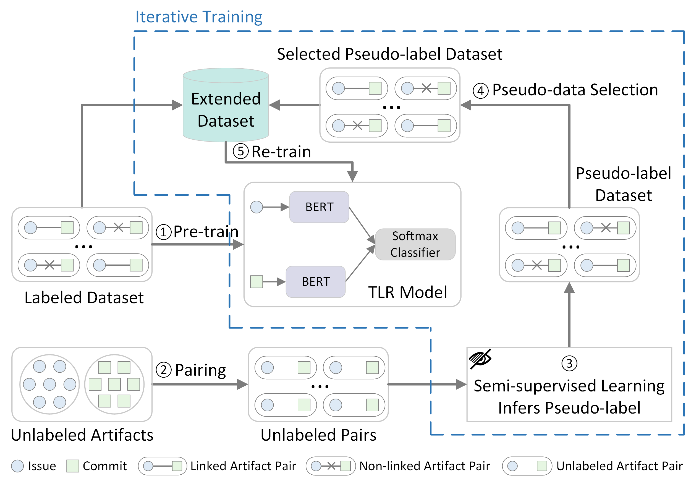

# DSSLink
Deep semi-supervised learning for recovering traceability links between issues and commits



### 1.Implementation Environment
DSSLink used different equipment for experiments based on the computing resource requirements of the specific method being enhanced. 

> For T-BERT, original, self-training and label propagation models are run on a machine equipped with an **Nvidia RTX 2080Ti** GPU. And TraceFUN is also running on this machine. 

> For BTLink, original and self-training models are run on a machine equipped with an **Nvidia RTX 3090** GPU, while label propagation is run on a machine equipped with an **Nvidia A100-PCIE-40GB** GPU.

### 2.Installation
Run the following command to install software dependencies (Python >= 3.8) on a Linux platform.
```commandline
pip install -r requirements.txt
```

### 3.Task Module Introduction
This repository contains three folders, corresponding to DSSLink enhanced T-BERT, DSSLink enhanced BTLink and TraceFUN.
```
DSSLink-Enhanced-T-BERT
DSSLink-Enhanced-BTLink
Tracefun
```
In DSSLink, each folder contains two sub-folders for deep semi-supervised learning, namely self-training and label_propagation.

In each deep semi-supervised learning folder, there are three important **.py** files. Their functions are introduced as follows:
```ruby
| File             | Description                   |
| ---------------- |:-----------------------------:|
| run.py           | The entry file                |
| train_stage1.py  | The baseline model            |
| train_deepssl.py | Deep semi-supervised learning |
```
where the **train_stage1.py** is used for the training of the original model and the pre-training of DSSLink.
### 4.Implementation Process
#### Step 1: Initialization data
Download the dataset from [Google Drive](https://drive.google.com/drive/folders/1XModCL0_SIzB-TjI7tzpTwpudZ-9eCb1?usp=sharing) and save it to a suitable location.
#### Step 2: DSSLink
First, specify the location of the dataset in **run.py**. 
```python
datasets_dir = 'Your datasets location'
```
For T-BERT, the models and evaluation results will be saved in **outputs_dir**. 

For BTLink, the models will be saved in **output_dir** and the results will be saved in **result_dir**. Please specify them in **run.py**.
```python
# T-BERT
outputs_dir = 'Your model and results location'
# BTLink
output_dir = 'Your model location'
result_dir = 'Your results location'
```
- If you need to modify the training parameters of network, such as learning rate and batch size, etc. It can be set specifically through the **train_stage1.py** and **train_deepssl.py**.
- After all settings are complete, run **run.py** to start executing tasks.
#### Step 3: TraceFUN
- TraceFUN includes a **labeling** folder for creating new links with unlabeled data, run **run.py** in the **labeling** folder to start labeling.
> In **run.py**, the variable **frac** represents the proportion of the amount of labeled data, and the number of new links to be created is determined by setting the variable **frac**. The default values of the variable **frac** for the Flask, Pgcli and Keras projects are 1.1, 1.1 and 0.05 respectively.
- After creating new links, run **run.py** in the **TraceFUN** folder to start the TraceFUN task.

### 5.Baseline Traceability Methods
- The **T-BERT** method evaluated in this paper can be found at [this link](https://github.com/jinfenglin/TraceBERT).
- The **BTLink** method evaluated in this paper can be found at [this link](https://github.com/OpenSELab/BTLink).

### 6.Models
The pre-trained BERT models used in T-BERT and BTLink can be obtained below:
- [RoBERTa-large](https://huggingface.co/roberta-large)
- [CodeBERT](https://huggingface.co/microsoft/codebert-base)

The number of models we trained is large, which you can obtain them from the following four links:
- [DSSLink Trained Models for T-BERT 1](https://zenodo.org/doi/10.5281/zenodo.10295771)
- [DSSLink Trained Models for T-BERT 2](https://zenodo.org/doi/10.5281/zenodo.10305257)
- [DSSLink Trained Models for BTLink 1](https://zenodo.org/doi/10.5281/zenodo.10279915)
- [DSSLink Trained Models for BTLink 2](https://zenodo.org/doi/10.5281/zenodo.10294818)


### Citation
```
@article{ZHU2024112109,
title = {Deep semi-supervised learning for recovering traceability links between issues and commits},
journal = {Journal of Systems and Software},
volume = {216},
pages = {112109},
year = {2024},
issn = {0164-1212},
doi = {https://doi.org/10.1016/j.jss.2024.112109},
url = {https://www.sciencedirect.com/science/article/pii/S0164121224001547},
author = {Jianfei Zhu and Guanping Xiao and Zheng Zheng and Yulei Sui},
keywords = {Traceability links recovery, Deep semi-supervised learning, Self-training, Label propagation, Issue and commit}
}
```

  
